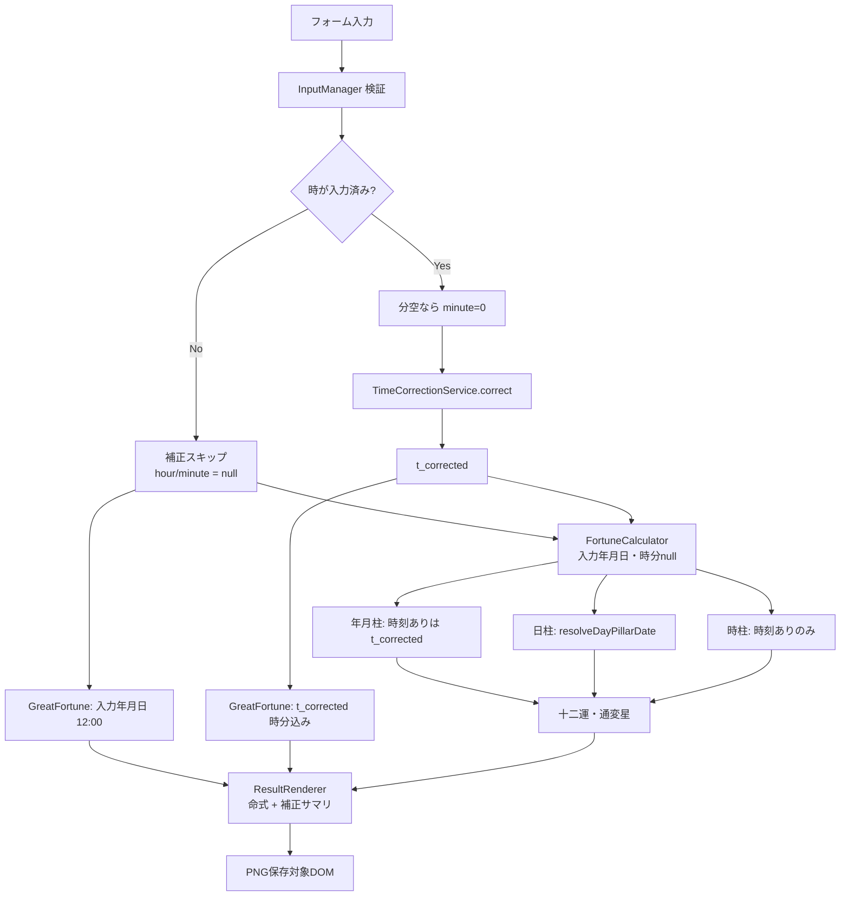

# 02. 処理パイプライン

## 1. 全体フロー



> 通変星・十二運は既存の四柱推命パイプラインとして維持する（禄命法化しない）。

## 2. ステップ詳細

### Step 1: 入力取得・検証

`FormRenderer.getValues()` → `InputManager` / `InputParser`:

- year, month, day, hour, minute, gender
- prefectureCode（未選択は `null`）
- offsetMinutes（正規化済み）
- shiMode

検証契約:

| 項目 | 契約 |
|------|------|
| 時空・分任意 | 時刻未入力 |
| 時あり・分空 | `minute = 0` |
| 都道府県コード | 未選択OK。選択時はマスタ存在必須（フォームエラー） |
| 子時モード | 空→`switch23`。定義外→フォームエラー |
| 時差 | ±23:59 外はフォームエラー |

### Step 2: 補正

時が null の場合:

```
correction = { applied: false, reason: 'no_time' }
```

時がある場合（分は number）:

```
correction = this.timeCorrectionService.correct({
  year, month, day, hour, minute,
  prefectureCode,
  offsetMinutes
})
// マスタはコンストラクタ注入済み
```

- `applied === true`（補正量0でも true）
- 出力 `corrected` が `t_corrected`

### Step 3: 命式計算

```
calculateFortune(y, m, d, h, mi, { shiMode })
```

内部:

1. 年月柱: 時刻ありは `t_corrected`、時刻なしは入力年月日で節入り比較
2. 日柱用日付: 時刻ありは **`resolveDayPillarDate(y, m, d, h, shiMode)`**、時刻なしは入力年月日
3. 時柱: 時刻ありのみ `calculateHourPillar(h, mi, dayStem, shiMode)`

### Step 4: 大運

**時刻あり:**

```
calculateCycles(t_corrected の y,m,d,h,mi, gender, ...)
  → calculateStartAge(..., h, mi, ...)
  → _getNextSolarTerm / _getPreviousSolarTerm(..., h, mi)
```

- 出生比較時刻に **補正後の時分** を使う
- 立運距離は **`getElapsedDays`（小数日）**。暦日整数差は使わない
- 子時の人工+1日は **適用しない**

**時刻なし（確定・V1.0踏襲）:**

```
calculateCycles(入力year, month, day, 12, 0, gender, ...)
```

- `t_corrected` は存在しない。正午固定で立運する

### Step 5: 表示

```
showResults(fortune, juuniun, tsuuhen, cycles, displayYear, {
  correction, shiMode
})
```

- `displayYear`: 補正適用時は `t_corrected.year`、未適用時は入力年

## 3. 日時の役割分担（確定）

| 用途 | 時刻あり | 時刻なし |
|------|----------|----------|
| 時差・経度合成結果 | `t_corrected` | なし（`applied:false`） |
| 年柱・月柱の節入り | `t_corrected` | 入力年月日 |
| 大運の節までの距離 | `t_corrected` の epoch 経過（**小数日**） | **入力年月日 12:00** からの epoch 経過 |
| 日柱の暦日 | `resolveDayPillarDate(...)` | 入力年月日 |
| 時支 | `t_corrected.hour` + `shiMode` | なし |
| 時干の日干 | 日柱日付の日干 | なし |

## 4. エラー伝播

| 発生源 | 表示 |
|--------|------|
| InputManager（時差・都道府県・子時モード等） | フォームエラー領域 |
| 経度マスタ破損・初期化失敗 | 初期化/計算エラー |
| 節気範囲外 | 既存エラー流用 |
