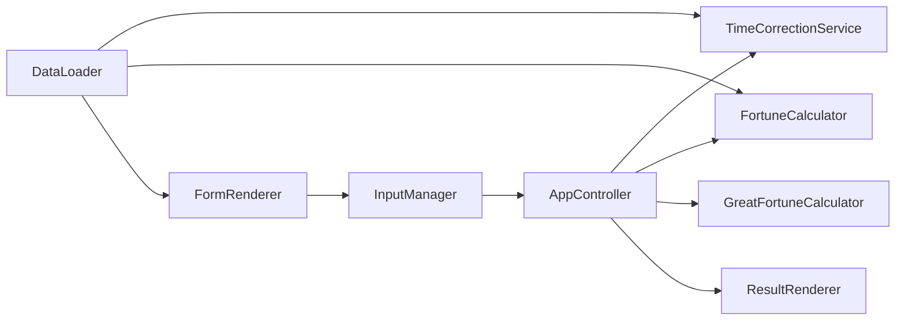

# 07. モジュール設計

## 1. コンポーネント関連図



## 2. 新規

### TimeCorrectionService

| 項目 | 内容 |
|------|------|
| パス | `js/core/TimeCorrectionService.js` |
| 責務 | 時差・経度補正、表示用文字列生成 |
| 依存 | コンストラクタ注入の経度マスタ、`DateUtils.addMinutes` |
| 非責務 | 干支計算、DOM、都道府県コードのユーザー入力検証 |

### resolveDayPillarDate

| 項目 | 内容 |
|------|------|
| 配置 | `FortuneCalculator` 内（private相当）。アプリ外部には非公開 |
| シグネチャ | `resolveDayPillarDate(year, month, day, hour, shiMode)` |
| 引数 | `year:number`, `month:number`, `day:number`, `hour:number`（0–23、`t_corrected` の時）, `shiMode:'switch23'\|'switch00'` |
| 戻り値 | `{ year: number, month: number, day: number }` |
| 責務 | `shiMode === 'switch23' && hour === 23` のとき `DateUtils.addDays(..., 1)`。それ以外は入力年月日をそのまま返す |
| 非責務 | 年月柱・大運・時差/経度補正 |

### テスト

- `tests/core/TimeCorrectionService.test.js`
- `tests/core/FortuneCalculator.shiMode.test.js`（または既存追記）
- `tests/core/GreatFortuneCalculator.timeCorrection.test.js`

## 3. 改修一覧

| モジュール | 変更内容 |
|------------|----------|
| `dataLoader.js` | `loadPrefectureLongitude` |
| `dateUtils.js` | `addMinutes` / `addDays`（数値カレンダー）+ **`toJstEpochMillis` / `createDate` / `parseISOString`（offset保持）/ `getElapsedDays`（小数日）/ `getCalendarDaysDifference`（暦日整数）** |
| `constants.js` | 子時モード定数、時差上限、`JST_OFFSET_MS` |
| `InputParser.js` | prefectureCode, offset, shiMode。旧 birthplace 削除 |
| `InputManager.js` | 時差・都道府県存在・子時モード契約・分0正規化 |
| `FormRenderer.js` | 新フィールド、都道府県生成 |
| `AppController.js` | 補正→命式→大運（時分）→表示年。`showResults` へ meta 配線 |
| `FortuneCalculator.js` | shiMode、`resolveDayPillarDate`、時支分岐、節入り epoch 比較 |
| `GreatFortuneCalculator.js` | `calculateStartAge` / 節探索へ時分追加。距離は `getElapsedDays`（小数日 / 3 → round/ceil） |
| `ResultRenderer.js` | 下表。P5配線 / P6描画 |
| `sidepanel.html` / `.css` | UI |
| `package.json` / footer | 1.5.0 |
| docs | USER_GUIDE / ALGORITHM |

### ResultRenderer（正式API）

| 項目 | 内容 |
|------|------|
| シグネチャ | `showResults(fortune, juuniunResults, tsuuhenResults, greatFortuneCycles, displayYear, meta = {})` |
| `displayYear` | 補正適用時は `t_corrected.year`、未適用時は入力年 |
| `meta.correction` | `TimeCorrectionResult` または `{ applied:false, reason:'no_time' }` |
| `meta.shiMode` | `'switch23'` \| `'switch00'` |
| `clear()` | 命式・大運・`#time-correction-summary` を空/非表示 |
| フェーズ | **P5:** 引数追加と呼び出し配線。**P6:** サマリ描画・PNG・clear 完成 |

## 4. GreatFortuneCalculator（確定）

現行は正午固定のため、**シグネチャ変更が必須**。

変更対象:

- `calculateStartAge(..., birthHour, birthMinute, ...)`
- `_getNextSolarTerm(year, month, day, hour, minute)`
- `_getPreviousSolarTerm(year, month, day, hour, minute)`
- `calculateCycles` は既存どおり時分を受け取り、上記へ伝播

内部で再補正しない。子時の人工+1日も適用しない。

立運距離:

```
elapsedDays = Math.abs(DateUtils.getElapsedDays(birthInstant, termInstant))
startAge = clamp(round_or_ceil(elapsedDays / 3), 0, 10)
```

`getCalendarDaysDifference` は使わない。

## 5. エラー責務

| ケース | 担当 |
|--------|------|
| 不正都道府県コード | InputManager → フォームエラー |
| 時差範囲外（±24:00含む）・子時定義外 | InputManager → フォームエラー（TC-09） |
| マスタ破損・欠落都道府県（内部） | TimeCorrectionService / 初期化 → 計算エラー |

## 6. 責務分離ルール

1. UIは補正計算をしない
2. FortuneCalculator は「与えられた日時＋shiMode」だけを解釈する
3. 時差・経度の合算は TimeCorrectionService のみ
4. 大運の節距離は `getElapsedDays`（epoch差の小数日）。暦日整数差は使わない
5. 節入りの前後判定は JST epoch 比較。ローカルDate成分は読まない

## 7. 初期化シーケンス

```
AppController.initialize
  → DataLoader
  → loadPrefectureLongitude
  → new TimeCorrectionService(master)
  → FormRenderer.populatePrefectures(master)
  → FortuneCalculator.initialize
  → GreatFortuneCalculator.initialize
  → …
```
