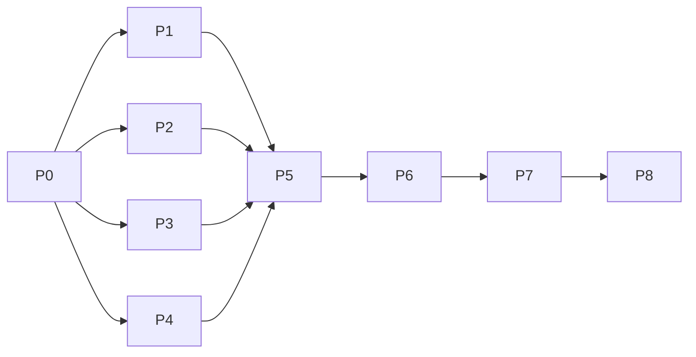

# 時刻補正 V1.5 実装タスクリスト（フェーズ計画）

実装着手前の作業分割。**各フェーズにテスト（自動またはチェックリスト）を必須**とする。  
詳細仕様は同ディレクトリの詳細設計、テストIDは `08_テスト設計.md` に準拠。

## 進め方

1. フェーズは **P0 → P8** の順に完了させる（依存あり）
2. 各フェーズの「完了ゲート」を満たしたら次へ進む
3. ゲート未達のまま次フェーズに進まない
4. 自動テストは当該フェーズ終了時に **グリーン** であること

---

## フェーズ一覧

| Phase | 名称 | 主な成果 | 必須テスト |
|-------|------|----------|------------|
| P0 | 基盤（マスタ・日時ユーティリティ） | JSON / DateUtils（加算+JST epoch+経過日） / 定数 / DataLoader | ユーティリティ単体 + マスタ読込 + DU-01〜05 |
| P1 | 時刻補正サービス | `TimeCorrectionService` | TC-01〜08, TC-10〜14 |
| P2 | 子時モード・命式 | `FortuneCalculator` 改修 | SM-01〜08, ST-02, ST-03 |
| P3 | 大運時分対応 | `GreatFortuneCalculator` 改修 | GF-01〜04 |
| P4 | 入力層 | Form / Parser / Manager / ヘルプ | 入力検証 + **TC-09** + UI-01〜03,06 |
| P5 | アプリ配線 | `AppController` + `showResults` | **IX-01〜04, ST-01**, 異常系, 12:00フォールバック |
| P6 | 結果表示・PNG | `ResultRenderer` / CSS / clear | UI-04,05,07,09 |
| P7 | 版・ドキュメント | `1.5.0` / GUIDE | UI-08 + ドキュメント確認 |
| P8 | 総合回帰・受入 | 全体グリーン | 全自動テスト + UI受入 |

---

## P0: 基盤（マスタ・日時ユーティリティ）

### 実装タスク

- [x] P0-1 `data/prefecture_longitude.json` 作成（正式スキーマ・47件・09準拠）
- [x] P0-2 `DataLoader.loadPrefectureLongitude()` 追加
- [x] P0-3 `DateUtils.addDays` 実装（`03` の `isLeapYear` / `daysInMonth` / 正負ループ。`new Date` 不使用）
- [x] P0-4 `DateUtils.addMinutes` 実装（`floorDiv` / `mod` 仕様どおり）
- [x] P0-5 `constants.js` に `SHI_MODE` / `DEFAULT_SHI_MODE` / `JST_REFERENCE_LONGITUDE` / `JST_OFFSET_MS` / `MAX_ABS_OFFSET_MINUTES` 追加
- [x] P0-6 `DateUtils` の JST 固定API
  - `toJstEpochMillis`
  - `createDate` → `new Date(toJstEpochMillis(...))`
  - `parseISOString` → offset **削除しない**（`new Date(isoString)`）
  - `getElapsedDays` → `(t2-t1)/86400000`（小数。大運距離）
  - `getCalendarDaysDifference` → JST暦日の整数差（大運距離には使わない）
  - 既存 `getDaysDifference` は **P0では暦日差の互換エイリアスとして残す**（日柱計算）。GreatFortune の `getElapsedDays` 置換は P3
  - `isValidDate` → `daysInMonth` ベース

### テスト（必須）

- [x] P0-T1 `DateUtils.addMinutes` / `addDays` 単体テスト
  - 同日内加減
  - 前日/翌日跨ぎ（負の剰余）
  - 月末（1/31+1日）
  - 年末（12/31 23:50+20分）
  - 閏日（閏年 2/28+1日）
  - 複数日跨ぎ
- [x] P0-T2 経度マスタ読込テスト（47件、`referenceMeridianEast===135`、東京 code `13` 存在）
- [x] P0-T3 **DU-01〜05**（epoch / ISO offset保持 / createDate / 暦日差 / **小数日の経過時間**）
- [x] P0-T4 既存テストが壊れていないこと（スモーク実行）

### 完了ゲート

- マスタJSONがスキーマどおり
- P0-T1〜T4 グリーン
- 節気ISOの `+09:00` を削る実装が残っていない

---

## P1: 時刻補正サービス

### 実装タスク

- [x] P1-1 `js/core/TimeCorrectionService.js` 実装
  - コンストラクタでマスタ注入
  - `correct` / `parseOffset` / `formatOffset`
  - `Math.round(4*(lon-135))`
  - `applied: true`（時刻あり前提）
- [x] P1-2 表示用文字列（input / offset / longitude / corrected）

### テスト（必須）

- [x] P1-T1 `TimeCorrectionService.test.js` で **TC-01〜08, TC-10〜14** を実装・グリーン
  - TC-02 に東京 **+19分** と表示文字列（`+19分` / 東京都）を含める
- [x] P1-T2 P0テスト継続グリーン
- [ ] **TC-09（±24:00）はP4**。本フェーズの完了条件に含めない

### 完了ゲート

- TC-01〜08, TC-10〜14 パス
- サービスが Calculator / UI に依存していない
- 時差範囲外はサービス責務としない（InputManager）

---

## P2: 子時モード・命式計算

### 実装タスク

- [x] P2-1 `resolveDayPillarDate` を `FortuneCalculator` に追加
- [x] P2-2 `calculateHourPillar` に `shiMode`（`switch23` / `switch00`）
- [x] P2-3 `calculateFortune` で年月柱=`t_corrected`、日柱=`resolveDayPillarDate`、時柱=モード適用
- [x] P2-4 節入り比較を `toJstEpochMillis` と `parseISOString`（offset保持）の epoch 比較へ切替
- [x] P2-5 既存23時台テスト期待値を V1.5 仕様へ更新（コメントで仕様変更を明記）

### テスト（必須）

- [x] P2-T1 **SM-01〜08**（時支・日柱・SM-02の時干）
- [x] P2-T2 **ST-02**（補正なし・非23時台で V1.0 同結果）
- [x] P2-T3 `resolveDayPillarDate` の境界（22/23/0/1時 × 両モード）
- [x] P2-T4 **ST-03**（数値JSTと節気ISOの epoch 境界。環境TZに依存しない式でアサーション）
- [x] P2-T5 既存 `FortuneCalculator` 関連テスト更新後グリーン

### 完了ゲート

- 子時2モードの柱計算が仕様どおり
- 人工+1日が日柱・時干以外に漏れていないこと（単体で確認可能な範囲）

---

## P3: 大運の時分対応

### 実装タスク

- [x] P3-1 `calculateStartAge` に `birthHour` / `birthMinute` 追加
- [x] P3-2 `_getNextSolarTerm` / `_getPreviousSolarTerm` に時分追加（正午固定廃止）
- [x] P3-3 節探索の前後判定は epoch 比較。立運距離は **`getElapsedDays`（小数日）/ 3 → round/ceil**
- [x] P3-4 `calculateCycles` から時分を伝播
- [x] P3-5 呼び出し側（この時点ではテスト／後続P5）の互換を確認

### テスト（必須）

- [x] P3-T1 **GF-02**（時分がAPIに渡り正午固定でない）
- [x] P3-T2 **GF-01**（次節/前節は同一、時分差で `elapsedDays/3` の丸め境界を跨ぎ開始年齢が変わる）
- [x] P3-T3 **GF-03**（23時台でも立運は渡した当日基準＝子時+1日を使わない）
- [x] P3-T4 **GF-04**（epoch差がTZ非依存、かつ小数日を保持。暦日整数差と一致しないこと）
- [x] P3-T5 既存 GreatFortune テストを新シグネチャへ更新しグリーン
- [ ] **ST-01 はP5**（補正×節入り跨ぎの年月柱は統合テスト）

### 完了ゲート

- 大運が時分を節距離に反映
- **GF-01〜04** グリーン（ST-01は完了条件に含めない）

---

## P4: 入力層（UI骨格・Parser・Manager）

### 実装タスク

- [x] P4-1 `sidepanel.html` 配置順どおりに項目追加（子時・都道府県・時差）
- [x] P4-2 `sidepanel.css`（`.tz-inputs` / `.help-text` 等）
- [x] P4-3 `FormRenderer`（bind / get / set / reset / `populatePrefectures`）
- [x] P4-4 `InputParser`（prefectureCode / offset / shiMode。旧 birthplace 削除）
- [x] P4-5 `InputManager` 検証
  - 時あり・分空 → 0
  - 時差 ±23:59
  - 都道府県コード存在確認
  - 子時: 未送信→`switch23`、定義外→エラー
- [x] P4-6 ヘルプ文
  - 時差の説明（国内0、海外はJST合わせ、夏時間は手動）
  - 子時モード選択に連動するヘルプ切替（`06_UI詳細設計.md` の文面）

### テスト（必須）

- [x] P4-T1 InputParser / InputManager 単体テスト
  - 分欠落→0
  - 時差境界・**TC-09（±24:00 はフォームエラー）**
  - 子時フォールバック / 不正値エラー
  - 不正都道府県コード→フォームエラー相当
- [x] P4-T2 **UI-01** 都道府県47件（マスタ生成後の件数確認。自動または手順書）
- [x] P4-T3 **UI-02, UI-03** デフォルト値（時差0、子時 switch23）
- [x] P4-T4 **UI-06** 時のみ入力の正規化（単体で担保）
- [x] P4-T5 時差・子時ヘルプ文がDOMに存在し、子時切替で文面が変わること

### 完了ゲート

- 入力契約が要件どおりに正規化・検証される
- TC-09 を含む P4-T1 グリーン、UI-01〜03/06 確認済み

---

## P5: AppController 配線

### 実装タスク

- [x] P5-1 初期化でマスタ読込 → `TimeCorrectionService` 生成 → 都道府県セレクト埋込
- [x] P5-2 `handleCalculate` で補正 → `t_corrected` を Fortune / GreatFortune へ
- [x] P5-3 `shiMode` を `calculateFortune` へ渡す
- [x] P5-4 表示年は補正適用時 `t_corrected.year`
- [x] P5-5 時刻なし経路
  - 補正スキップ・時柱なし
  - 大運は **入力年月日 12:00**
- [x] P5-6 `ResultRenderer.showResults(..., displayYear, { correction, shiMode })` を呼び出す（**API拡張と配線**。サマリDOMの完成はP6）

### テスト（必須）

- [x] P5-T1 **IX-01〜04**（補正×子時の合成境界。`08` の表どおり）
- [x] P5-T2 時刻なし経路
  - 時柱 null、`applied: false`
  - 大運引数が入力年月日 **12:00** であること
- [x] P5-T3 補正あり経路で Fortune と GreatFortune に同じ `t_corrected` が渡ること
- [x] P5-T4 **ST-01**（補正で節入りを跨ぐ年月柱）
- [x] P5-T5 節気データ範囲外の入力で既存エラーが表示されること
- [x] P5-T6 経度マスタ欠落・破損時の初期化/計算エラー
- [x] P5-T7 P0〜P4 既存自動テスト継続グリーン

### 完了ゲート

- 端到端の計算経路が仕様の日時役割分担どおり
- IX-01〜04、ST-01、時刻なし12:00、異常系がグリーン
- `showResults` に `displayYear` と `{ correction, shiMode }` が渡る

---

## P6: 結果表示・PNG

### 実装タスク

- [x] P6-1 `ResultRenderer` に補正サマリ描画
  - 適用時: 「時刻補正: 適用」+ 内訳
  - 未入力時: 1行メッセージ
  - `switch23`×23時台の注記
- [x] P6-2 サマリを PNG キャプチャ対象 DOM 配下へ配置
- [x] P6-3 CSS 調整（可読性）
- [x] P6-4 `clear()` で `#time-correction-summary` を空・非表示にする

### テスト（必須）

- [x] P6-T1 サマリHTML生成の単体/スナップ相当（適用・未入力・注記あり）
  - `clear()` 後にサマリDOMが空/非表示であること
- [x] P6-T2 **UI-04, UI-05** 手動またはDOMアサーション
- [x] P6-T3 **UI-07** PNGにサマリが写る目視確認（チェックリスト記録）
  - 自動: `#time-correction-summary` が `#result-section` 配下・命式テーブル直前（既存キャプチャ対象）
  - 実機PNG目視は P8
- [x] P6-T4 **UI-09** 年跨ぎ時の表示年（結合結果）

### 完了ゲート

- 画面・PNG要件を満たす
- UI-04/05/07/09 確認済み

---

## P7: バージョン・ドキュメント

### 実装タスク

- [x] P7-1 `chrome-extension/package.json` → `1.5.0`
- [x] P7-2 `chrome-extension/sidepanel.html` フッタ → `v1.5.0`
- [x] P7-3 `chrome-extension/docs/USER_GUIDE.md` 更新（時差・都道府県・子時・23時台日跨ぎ・大運時分・時刻なし12:00）
- [x] P7-4 `chrome-extension/docs/ALGORITHM.md` 更新（補正式・子時・日時役割分担）

### テスト（必須）

- [x] P7-T1 **UI-08** フッタ / package バージョン一致確認
- [x] P7-T2 ドキュメントに東京+19分、`resolveDayPillarDate` 適用範囲、大運時分が記載されていること（チェックリスト）
- [x] P7-T3 自動テスト一式の再実行（ドキュメント変更による破壊がないこと）

### 完了ゲート

- 版表記とユーザー向け説明が実装と一致

---

## P8: 総合回帰・受入

### 実装タスク

- [x] P8-1 全自動テスト実行・失敗ゼロ
- [x] P8-2 受入チェックリスト UI-01〜09 を最終確認
- [x] P8-3 既知差分（23時台日柱、大運時分）の説明がガイドにあることを再確認
- [x] P8-4（任意）実装メモ / 変更点サマリを design 配下へ残す

### テスト（必須）

- [x] P8-T1 全スイートグリーン（P0〜P6で追加した全テスト含む）
- [x] P8-T2 受入 UI-01〜09 すべてチェック
- [x] P8-T3 回帰観点: 補正なし・非23時台の代表ケースが V1.0 と一致

### 完了ゲート（リリース判定）

1. 要件・詳細設計の確定項目を満たす  
2. 時刻ありの大運は補正後時分、時刻なしは入力年月日12:00  
3. `resolveDayPillarDate` が日柱・時干のみ  
4. 東京 +19分  
5. 全自動テスト通過  
6. PNGに補正情報・子時モード  
7. バージョン `1.5.0`  

---

## 依存関係（簡易）

※ P2 と P3 はいずれも **P0 完了後に並行開始可能**（相互依存なし）。ST-01 / IX は P5 の統合テスト。

---

## 作業開始時の推奨

1. 本リストの承認（このまま実装してよいか）
2. ブランチ作成例: `feature/v1.5-time-correction`
3. P0 から着手し、フェーズごとにコミット
