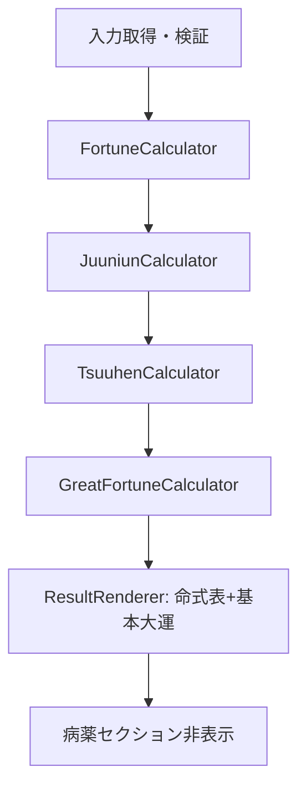
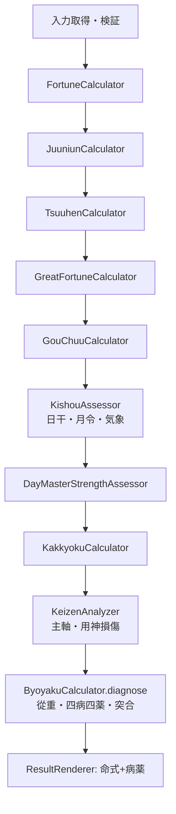

# 04. アーキテクチャとデータフロー

## 1. 方針

- **計算の分岐は AppController に集約**する
- **表示の分岐は ResultRenderer に集約**する
- **既存 ByoyakuCalculator と格局ルールを土台に拡張**し、気象・継善は責務を分けた新規モジュールとする
- オプション状態は単一の boolean（または mode enum）で扱う

## 2. 論理構成

```text
┌─────────────────────────────────────────┐
│                 UI Layer                 │
│  FormRenderer  ResultRenderer  Switch    │
└───────────────┬─────────────────────────┘
                │
┌───────────────▼─────────────────────────┐
│              AppController               │
│  - featureFlags.byoyakuEnabled           │
│  - handleCalculate() でパイプライン分岐   │
└───────────────┬─────────────────────────┘
                │
        ┌───────┴────────┐
        ▼                ▼
  Core (常時)      Core (病薬ON時のみ)
  Fortune          GouChuu
  Juuniun          Strength
  Tsuuhen          Kakkyoku
  GreatFortune     Byoyaku
                   Kishou
                   Keizen
└─────────────────────────────────────────┘
                │
                ▼
           Data (JSON)
  solar_terms / stem_branch / juuniin
  kakkyoku_rules（病薬ON時）
```

## 3. 処理フロー

### 3.1 命式のみ（`meishiki_only`）



### 3.2 命式 + 病薬（`meishiki_with_byoyaku`）



`KakkyokuCalculator` は既存都合で気象を入力にしない。ここでいう順序契約は、気象を先に確定し、病薬処方が必ず `kishouResult` を参照することを意味する。

## 4. モジュール変更方針

| モジュール | 変更内容 |
|------------|----------|
| `AppController.js` | `byoyakuEnabled` を読み、計算分岐。`showResults` へ渡す引数を整理 |
| `FormRenderer.js` / `sidepanel.html` | 計算前オプションスイッチを追加 |
| `ResultRenderer.js` | 病薬セクションを独立描画。OFF時はDOM非表示＆中身クリア |
| `KishouAssessor.js` | 新規。月令から寒暖・燥湿・調候方向を算出 |
| `KeizenAnalyzer.js` | 新規。格局の主軸と用神損傷 `breaks[]` を構造化 |
| `ByoyakuCalculator.js` | 月令ブースト、從重結果接続、気象・継善との突合、バランス算出を追加 |
| `KakkyokuCalculator.js` 等 | 原則変更なし |
| `manifest.json` | 説明文の更新（任意）。`storage` 権限は永続化採用時のみ追加 |

## 5. API／メソッド契約（変更案）

### 5.1 AppController

```text
featureFlags = {
  byoyakuEnabled: boolean  // default false
}

handleCalculate():
  fortune, juuniun, tsuuhen, greatFortune を算出
  if featureFlags.byoyakuEnabled:
      gouChuu, kishou, strength, kakkyoku, keizen, byoyaku を算出
  else:
      gouChuu=kishou=strength=kakkyoku=keizen=byoyaku = null
  resultRenderer.showResults(..., { byoyakuEnabled, ... })
```

### 5.2 ResultRenderer.showResults

現行の長い引数リストを、段階的に options オブジェクト化してもよい（任意リファクタ）。

最低限の契約:

```text
showResults({
  fortune, juuniun, tsuuhen, greatFortune, birthYear,
  byoyakuEnabled,
  strength?, kakkyoku?, byoyaku?, gouChuu?
})
```

- `byoyakuEnabled === false` のとき病薬関連DOMを出さない
- `true` かつ `byoyaku` があるときのみ `renderByoyaku(...)` を呼ぶ

### 5.2b ByoyakuCalculator.diagnose

```text
diagnose({
  kakkyokuResult, strengthResult, fortuneResult, tsuuhenResult,
  gouChuuResult?, kishouResult, keizenResult
}) → ByoyakuResult
```

v2の正規APIはobject引数に統一する。位置引数形式を残す場合は移行用アダプタとし、設計・新規テストではobject形式を使用する。

### 5.3 描画メソッド分割（推奨）

現行 `renderKakkyokuByoyaku` は格局と病薬が結合している。

| 案 | 内容 | 採用 |
|----|------|------|
| A | `renderByoyakuSection(strength, kakkyoku, byoyaku)` に改名し、病薬主・格局補助の1セクション | **推奨** |
| B | `renderStrength` / `renderKakkyoku` / `renderByoyaku` に完全分離 | 将来拡張向け |

本変更では案Aで十分。タイトルは「病薬診断」とし、格局は補助行として残す。

## 6. データ依存

| モード | 必要データ |
|--------|------------|
| 命式のみ | solar_terms, stem_branch, juuniin, gokotongetsuketsu |
| +病薬 | 上記 + `kakkyoku_rules.json` |

最適化（任意）: 病薬OFF時は `kakkyoku_rules.json` の遅延ロードも可能。初期実装では現行どおり初期化時ロードでもよい。

## 7. テスト方針

| 種別 | 内容 |
|------|------|
| 既存単体 | `ByoyakuCalculator.test.js` 等は維持 |
| 追加 | AppController 相当の分岐テスト（または薄い FeatureFlag ヘルパのテスト） |
| 手動 | OFF/ON で画面差分を確認 |

テスト追加の詳細は [06_実装計画と未決事項.md](./06_実装計画と未決事項.md)。
