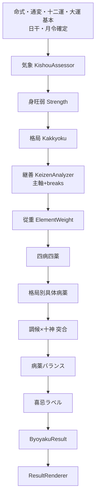

# 02. 処理パイプラインとモジュール構成

| 文書ID | BYO-DD-02 |
|--------|-----------|

## 1. 全体フロー



※ 合冲は A〜F の五行分布補正として任意挿入（推奨: Strength/Kakkyoku 前または並行）。

## 2. モジュール責務

| モジュール | 種別 | 責務 | 主な出力 |
|------------|------|------|----------|
| `DayMasterStrengthAssessor` | 既存 | 身旺弱 | `strengthResult` |
| `KakkyokuCalculator` | 既存 | 格局名／成格 | `kakkyokuResult` |
| `KishouAssessor` | **新規** | 寒暖燥湿（清濁） | `kishouResult` |
| `KeizenAnalyzer` | **新規** | 主軸・用神損傷 | `keizenResult` |
| `ByoyakuCalculator` | **拡張** | 從重〜病薬確定 | `byoyakuResult` |
| `ResultRenderer` | 拡張 | 表示 | DOM |

### 2.1 オーケストレーション（AppController）

病薬オプションON時のみ:

```text
fortune, juuniun, tsuuhen, greatFortune = ...
gouChuu = analyzeNatalChart(fortune)          // 内部補正用。UIには出さない
kishou   = KishouAssessor.assess(fortune, elementDist?)
strength = assess(fortune, juuniun, gouChuu)
kakkyoku = calculate(fortune, tsuuhen, strength, gouChuu)
keizen   = KeizenAnalyzer.analyze(kakkyoku, strength, tsuuhen, fortune)
byoyaku  = ByoyakuCalculator.diagnose({
             kakkyoku, strength, fortune, tsuuhen, gouChuu,
             kishou, keizen
           })
```

気象は格局・用神の確定より先に評価する。既存 `KakkyokuCalculator` 自体へ気象を渡す必要はないが、`ByoyakuCalculator` は `kishou` と `keizen` の両方を必須入力として処方を確定する。

## 3. 柱ウェイト（喜忌篇）

五行分布・條件カウントに使う標準係数。

| 対象 | 係数 | 根拠 |
|------|------|------|
| 月支（月令）司令 | ×2.0（蔵干主気に乗算、または加算ブースト +1.0） | 月令提綱 |
| 月干 | ×1.2 | 提綱の表層 |
| 日干 | 分布からは除外（主体。比劫判定時のみ日支根を見る） | 日主 |
| 年干／時干 | ×1.0 | 基根・分野 |
| 年支／日支／時支 蔵干主気 | ×0.7 | 既存 |
| 蔵干中気 | ×0.5 | 既存 |
| 蔵干余気 | ×0.3 | 既存 |
| 透干（天干）同五行 | 蔵干同五行より常に重く扱う | 透干優先 |

**レビュー確認:** 月令ブースト値（×2.0 or +1.0）の採否。

## 4. エラー伝播

| 段階 | 失敗時 |
|------|--------|
| 命式 | 全体中断 |
| 身旺弱／格局 | 病薬中断。命式は表示可 |
| 気象 | 中断せず `kishou=neutral` フォールバック＋警告（推奨） |
| 継善 | 中断せず格局カテゴリのみで続行 |
| 病薬本体 | エラー表示。命式は維持 |

## 5. パフォーマンス

病薬ON時の追加コストはローカルJSON参照とO(1)〜O(柱数)計算のみ。遅延ロードは任意。

## 6. ファイル配置案

```text
js/core/KishouAssessor.js          … 新規
js/core/KeizenAnalyzer.js          … 新規
js/core/ByoyakuCalculator.js       … 拡張
data/kishou_rules.json             … 任意（閾値外出し）
data/kakkyoku_rules.json           … 既存維持
tests/core/KishouAssessor.test.js
tests/core/KeizenAnalyzer.test.js
tests/core/ByoyakuCalculator.test.js  … 拡張
```
